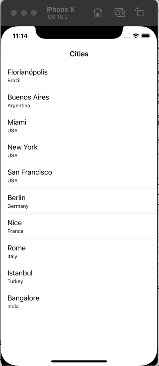

# Navigation coding challenge

Swift course navigation coding challenge

## Steps

1. Download the attached starting project for this lecture article.

2. In ViewController class, didSelectRowAt function located inside extension ViewController: UITableViewDelegate, you will need to implement different navigation techniques.

3. If the selected cell's indexPath.row is even number (i.e. the indexPath.row is divisible by 2), then you will need to present modally a view controller with blue background. In other words, you can present a view controller that has blue background using popover modal presentation style. To check whether the indexPath.row divisible by 2, you can also use % operation such as indexPath.row % 2 == 0

4. If the selected cells's indexPath.row is an odd number (i.e. the indexPath.row is not divisible by 2), then you will need to navigate to a view controller with a green background. The navigation should be done using navigation stack by pushing the new view controller.

5. **(bonus)** However if the selected cell is the last cell in the table view, then you will need to navigate using segue (i.e. performSegue). You can set up the segue in the Main.storyboard for the project. You will need to add a new view controller from the library (by tapping on + button in Interface Builder). After you added a new view controller from library, you will need to connect current view controller showing cities table view to the new view controller using segue connection. The segue connection then should be assigned a name of your preference. Afterwards, you can use that name with performSegue function from your ViewController when user taps on the last cell of the table view. Also, please make sure to embed your ViewController that shows table view inside Navigation Controller stack like it was shown in the previous lectures.

## Result

